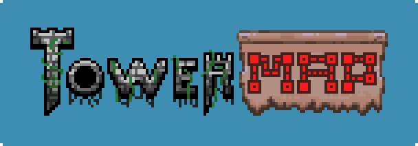
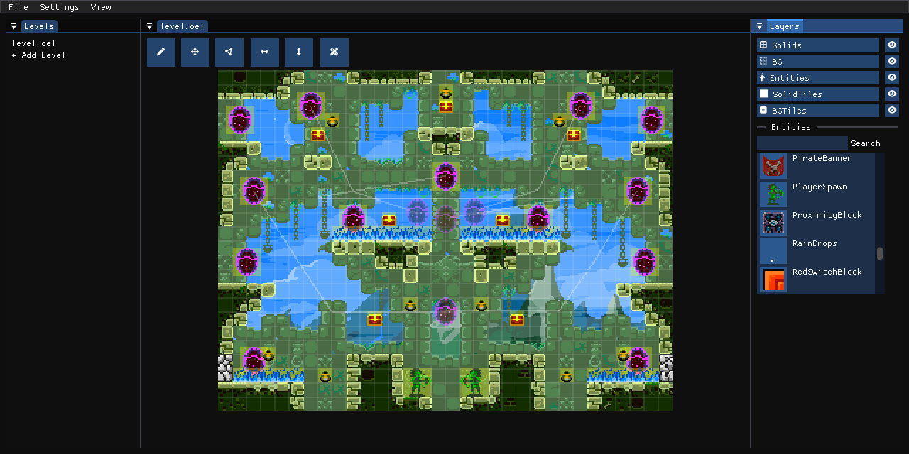

# Towermap
An alternative TowerFall Level editor that supports more game elements and game mode.

> [!CAUTION]
> DO NOT CURRENTLY EDIT VANILLA LEVELS AS MOST ENTITIES WERE MISSING

## WORK IN PROGRESS
This level editor is still work in poggers, and it still effectively being developed by a
single person.

## Contributing
If you want to contribute in this project, make sure you have TowerFall and bring your own assets for now.
Clone [Riateu](https://github.com/Terria-K/Riateu) project and put it next to the project folder, you also need some of its
dependencies and build its native library.

## Dependencies:
+ [SDL3](https://www.libsdl.org) - Rendering backend, File dialog handling, etc.
+ [Riateu](https://github.com/Terria-K/Riateu) - A primary engine for this app.
+ [Jint](https://github.com/sebastienros/jint) - For extensible entity definition using JavaScript.